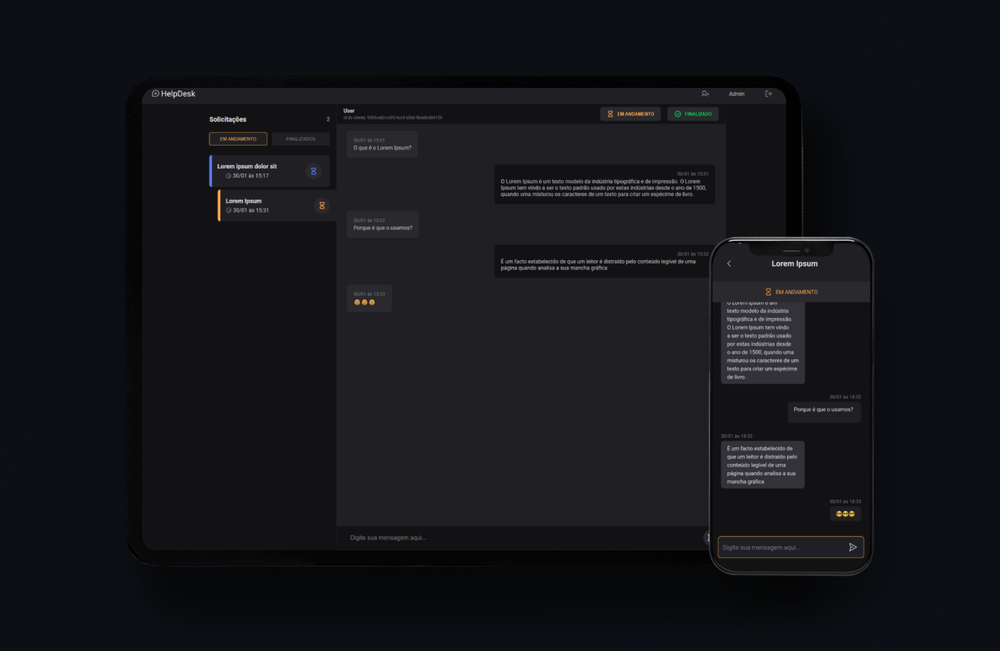
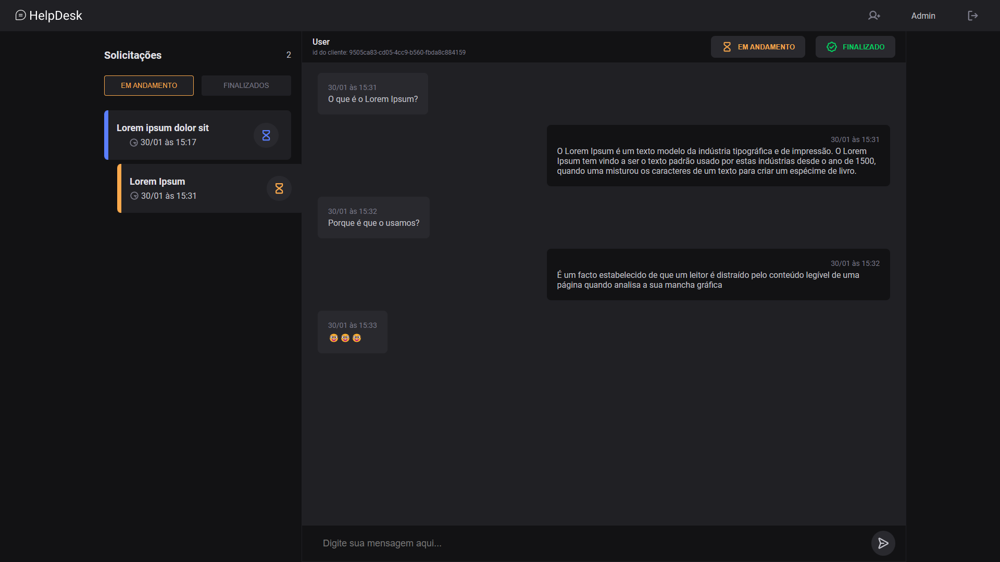
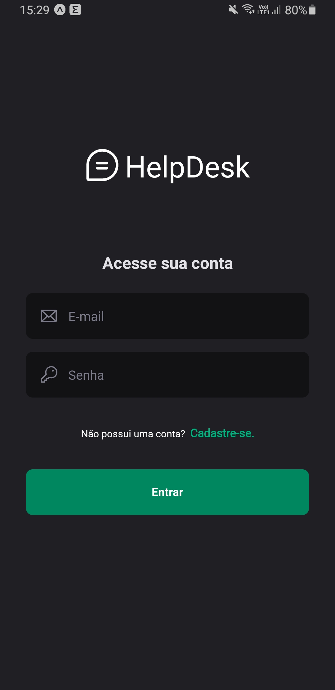
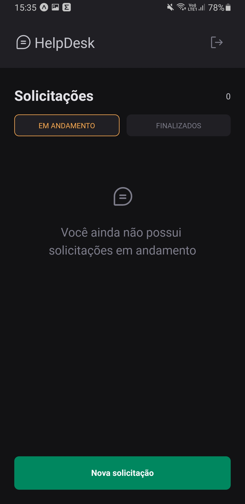
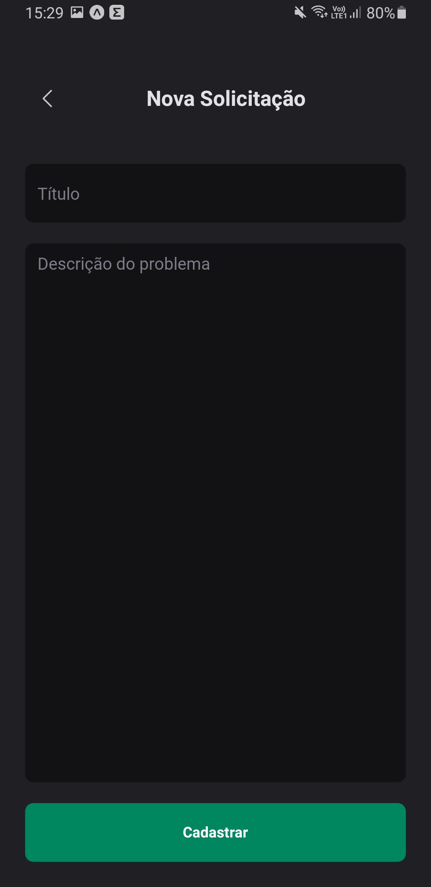
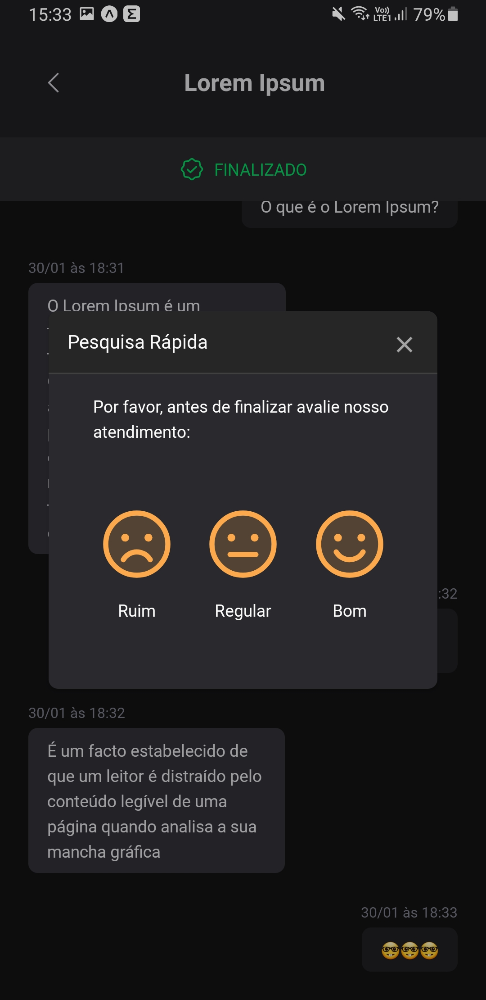

# HelpDesk

Esta aplicação é uma central de ajuda para usuários de um aplicativo móvel. Onde os usuários do aplicativo poderão abrir chamados e conversar com atendentes que estarão utilizando um gerenciador de chamados.

<br>

> **Funcionalidades do aplicativo:**
- [x] Cadastro de novos usuários com permissões restritas.
- [x] Autenticação de usuários.
- [x] Abertura e acompanhamento de chamados.
- [x] Chat em tempo real com usuários do gerenciador.
- [x] Pesquisa de satisfação ao finalizar um chamado.

> **Funcionalidades do gerenciador:**
- [x] Autenticação de usuários.
- [x] Atualização em tempo real de chamados abertos.
- [x] Chat em tempo real com usuários do aplicativo.
- [x] Atualização do status de chamados.
- [x] Cadastro de novos usuários com permissões especiais.

<br>

<div style="display:flex;justify-content:space-around;flex-flow:row wrap">
  
  
  
  
  
  
</div>

<br>

## Técnologias usadas

**Front-end:**
> TypeScript, React, Styled Components, Axios e Socket.io.

**Back-end:**
> TypeScript, NodeJS, ExpressJS, JWT, Prisma, SQLite e Socket.io.

**Mobile:**
> TypeScript, React Native, NativeBase, Axios e Socket.io.

<br>

## Como baixar e executar a aplicação

```
    git clone git@github.com:franklinrms/helpdesk.git
    cd helpdesk
```

<br>

**Executar com Docker:**
> Para utilizar este método você precisa estar com o `Docker` instalado em seu computador.

```
    npm run compose

    ou

    docker-compose up -d --build
```
<br>

**Executar sem Docker:**
> Para utilizar este método você precisa estar com o `node` instalado em seu computador.

* Para rodar o back-end:
    > Você deverá renomear o arquivo  `.env.example` para `.env`
  ```
    cd server && npm install && npm start
  ```
* Para rodar o front-end:
  ```
    cd web && npm install && npm start
  ```
* Para rodar o mobile:
  ```
    cd mobile && npm install && npm start
  ```

<br>

## Como usar a aplicação

**Para acessar o aplicativo:**  <br>

  > - Você precisa alterar o endereço do servidor no arquivo `api.ts` que está localizado no diretório `mobile/src/lib` para o endereço do seu computador. <br>
  > Obs: você pode encontrar o seu IP com o comando `ipconfig` no Windows ou `ifconfig` no Linux.
  > - E instalar o aplicativo **Expo Go.** Ele é o responsável por pegar o código que o `metro bundler` envia e exibir em tela o seu app React Native. <br>
  > Para instalá-lo, basta buscar nas lojas o aplicativo **Expo Go** no seu celular ou no emulador.
  > - No Expo Go, basta escanear o QR Code que aparece no terminal quando você executa o comando `npm start` no diretório `mobile`. Ou inserir o endereço manualmente: `exp://{SEU IP}:19000` <br>
  > Obs: se estiver usando o **Expo Go** no celular o aparelho deve estar na mesma rede que o computador. <br>
  > <br>
  > Com o aplicativo rodando cadastre-se com um novo usuário ou faça login com as seguintes credenciais:
  ```
      email: user@user.com
      senha: user
  ```

**Para acessar o gerenciador:** <br>

> Basta acessar o endereço http://localhost:3000 e fazer o login com uma das seguintes credenciais:
  > - com permissão de administrador:
  ```
      email: admin@admin.com
      senha: admin
  ```
  > - com permissão de atendente:
  ```
      email: helper@helper.com
      senha: helper
  ```

## Contato

[](https://www.linkedin.com/in/franklinrms/)
[](mailto:franklinramos@outlook.com)
[](https://www.codebyfranklin.cf/)
